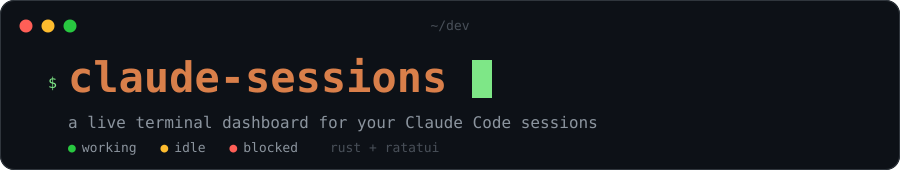

<p align="center">
  
</p>

<p align="center">
  <a href="https://github.com/joshjetson/claude-sessions/actions/workflows/ci.yml"></a>
  <a href="https://crates.io/crates/claude-sessions"></a>
</p>

<p align="center">
  <strong>A live terminal dashboard for your Claude Code sessions</strong><br/>
  Watch every session on your machine — status, context usage, and the conversation as it happens.
  Attach, prompt, and kill sessions without leaving the dashboard. Wire in a task board,
  QA pipelines, and deploy tracking when you want the full workflow.
</p>

```text
                             Claude Sessions Dashboard   —  2h 41m / 4 proj

╭ Sessions ──────────────────────────────────────────────────────╮╭ Conversation ──────────────────────╮
│▼ 📁 dev/portal  2 sessions  186K tokens                        ││96K tokens (48%)  │  last: 09:14 PM │
│    ● 8f3a  Edit src/orders/split.rs...  142K (71%)             ││                                    │
│    ● 514e  idle  44K (22%)  main                               ││You:                                │
│▼ 📁 dev/api  1 session  96K tokens                             ││the retry test is still flaky — look│
│    ● c2d1  awaiting input  96K (48%)  fix/webhook-retry        ││at it before we merge               │
│▼ 📁 dev/site  1 session                                        ││                                    │
│    ● new  starting…                                            ││Claude:  (+1.4K)                    │
│                                                                ││[Read: src/webhook/retry.rs]        │
│── work ──────────────────────────────────────                  ││[Bash: cargo test --lib webhook]    │
│▼ 📁 work/billing  1 session  31K tokens                        ││The flake is the 250ms sleep: on a  │
│    ● 9b07  idle  31K (16%)  main                               ││loaded runner the second attempt    │
│                                                                ││lands before the clock advances.    │
│                                                                ││Using the injected clock the rest of│
│                                                                ││the suite already uses:             │
│                                                                ││                                    │
│                                                                ││  - thread::sleep(BACKOFF);         │
│                                                                ││  + clock.advance(BACKOFF);         │
│                                                                ││                                    │
│                                                                ││Twenty runs, no failures. Open the  │
│                                                                ││merge request?                      │
│                                                                ││                                    │
│                                                                ││● awaiting input                    │
╰────────────────────────────────────────────────────────────────╯╰────────────────────────────────────╯
 09:14:37 PM  │  Tab view  S-Tab panel  ←→ expand  Enter select  o terminal  x kill  X purge  s settings  q quit
```

---

## Index

- [Overview](#overview)
- [Quick Start](#quick-start)
- [Requirements](#requirements)
- [Getting around](#getting-around)
- [Features](#features)
- [Subcommands](#subcommands)
- [Shortcuts](#shortcuts)
- [Configuration](#configuration)
- [Environment](#environment)
- [Terminal Drivers](#terminal-drivers)
- [Reporting Back: notify / done / blocked](#reporting-back-notify--done--blocked)
- [Architecture](#architecture)
- [Building from Source](#building-from-source)
- [Ported from the original](#ported-from-the-original)
- [Contributing](#contributing)
- [License](#license)

---

## Overview

`claude-sessions` discovers every [Claude Code](https://docs.claude.com/en/docs/claude-code)
session running on your machine and renders them as a live dashboard: which project each
session belongs to, whether it is working, idle, or blocked waiting on you, how much of its
context window is spent, and the conversation itself streaming in a side pane.

It is a ground-up Rust rewrite of a Node/Ink tool that ran a delivery workflow daily for a
year, built on [ratatui](https://ratatui.rs). The rewrite exists for one reason: the original
spent a React runtime re-rendering a terminal — this one is a single static binary that starts
instantly, idles at ~zero CPU, and installs with one command.

Beyond watching sessions, it can run your delivery workflow end to end:

- **Sessions** — monitor, attach to, prompt, and kill local Claude Code sessions
- **Board** — an Odoo task board: spawn a session against a task, track it to done
- **Pipelines** — multi-step agent pipelines, per-project overridable, with a viewer
- **Deploy** — per-project deploy definitions, live merge-request state, one-key shipping
- **Daemon** — a background watcher that alerts you the moment a session needs a decision

The Sessions surface works standalone with zero configuration. Board, Pipelines and Deploy
light up when you point the config at your Odoo instance and your GitLab host.

## Quick Start

Never touched Rust? That's fine — you only need it to install, and it's two commands.
**No flags needed**: not `--locked`, not anything. A bare install is CI-tested on every
change so it always builds.

### macOS / Linux

```bash
# 1. Install Rust (skip if `cargo --version` already works)
curl --proto '=https' --tlsv1.2 -sSf https://sh.rustup.rs | sh
# ...accept the defaults, then open a NEW terminal window

# 2. Install the dashboard
cargo install claude-sessions

# 3. Run it
claude-sessions
```

On macOS, also install [iTerm2](https://iterm2.com) or [tmux](https://github.com/tmux/tmux)
if you want the dashboard to launch and control terminals — monitoring works without them.

### Windows (PowerShell or cmd)

```powershell
# 1. Install Rust: download and run rustup-init.exe from https://rustup.rs
#    Accept the defaults (it installs the C++ build tools it needs),
#    then open a NEW PowerShell window.

# 2. Install the dashboard
cargo install claude-sessions

# 3. Run it
claude-sessions
```

> Native Windows support is new in v1.1: the dashboard, daemon, task board, deploy
> list, journal, and pipelines all work, and the sessions list shows sessions from
> recent transcript activity; process-level detail — opening, focusing and stopping
> a session — follows in a coming release. Running Claude Code
> inside **WSL**? Use the macOS/Linux steps inside WSL — that gets the full feature set
> today.

### Getting around

The dashboard has three screens — **Sessions**, **Board**, and **Deploy** — and you
move between them with **`Tab`** (`Shift-Tab` cycles the focused pane). If you have an
Odoo board configured, `claude-sessions` opens on **Board**, so press `Tab` once to
reach your live sessions. Sessions are grouped by their working directory, not by the
terminal tab or tmux window they run in — so look for the folder you launched from, not
the tab name. The bottom status bar always lists the keys for the screen you are on; the
full set is under [Shortcuts](#shortcuts).

### After installing

The **Sessions** tab needs zero configuration — run `claude-sessions` and your sessions
appear (macOS, Linux, and WSL; on native Windows the sessions list shows transcript
activity from the last few hours, and process-level detail arrives later). For the Odoo board, GitLab, and Optics, copy
[`config.example.json`](config.example.json) to `~/.claude-sessions.json` and fill in
only the blocks you want — every key is optional and every block is independent.

To upgrade later, run `cargo install claude-sessions` again — then run
`claude-sessions daemon stop` once, so the new build's daemon replaces the old one on
the port.

### If the sessions list is empty

Run `claude-sessions doctor`. It prints, in one screen, which program owns the daemon
port, whether `claude` on your PATH is a native binary or a script, whether transcripts
exist where this build looks for them, and how many processes survive each step of
discovery. It contains no passwords, tokens or transcript text, so it can be pasted
straight into an issue.

The single most common cause is another program on the daemon port — a daemon from an
older install, or the Node tool this one replaced, which uses the same name and the same
default port. A dashboard will not mirror a daemon that does not identify itself as this
build: it says so on the status bar, scans your machine itself, and keeps working.
`claude-sessions daemon stop` clears the port, or give this build one of its own with
`daemon.port` in `~/.claude-sessions.json`.

## Requirements

| | |
|---|---|
| **Rust 1.85+** | only to install: `curl --proto '=https' --tlsv1.2 -sSf https://sh.rustup.rs \| sh`, or `brew install rust`. The published binary has no runtime dependencies — SQLite is bundled and TLS uses the platform stack, so there is no `cmake`, no `nasm`, no system library to find. |
| **The `claude` CLI on `PATH`** | how sessions are discovered, launched and resumed. |
| **iTerm2 or tmux** | for terminal control — launching a session, focusing its tab, typing a prompt into it. [iTerm2](https://iterm2.com) is preferred on macOS (allow the automation prompt on first use); [tmux](https://github.com/tmux/tmux) works anywhere, including over SSH. Without either, the dashboard still monitors everything and simply says so where a launch would happen. |
| **Optional: `glab`** | the [GitLab CLI](https://gitlab.com/gitlab-org/cli), authenticated against your host. Without it the Deploy tab explains what to install; everything else is unaffected. |
| **Optional: an Odoo instance** | for the Board and Deploy tabs. Without credentials those tabs say so and the Sessions tab is unchanged. |

macOS is the first-class platform (the iTerm2 driver, `afplay` sounds, `open`). Linux works
with the tmux driver.

## Features

- **Live session discovery** — every Claude Code process on the machine, paired to its own
  transcript by four ranked strategies, grouped by project, appearing the moment it starts
- **Status at a glance** — working / idle / awaiting-you, per session and per project, from
  the transcript's last entry rather than from a guess
- **Context meter** — per-session token usage and percentage of the context window
- **Conversation pane** — the transcript as it streams, with syntax-highlighted code blocks
  and rendered tool calls; scroll it, filter it, search it, timestamp it
- **Session control** — focus a session's terminal (`o`), start a new one in a folder (`n` —
  press `F` first to show the quiet folders in a group),
  kill one (`x`), or purge every session whose task is finished — tabs and all (`X`)
- **Odoo task board** — projects, stages, tasks and subtasks with story points, deadlines,
  archived-transcript and recorded-coverage badges; start a task (`s`) and the dashboard
  writes the prompt, opens a terminal and links the session to the task
- **Dependency aware** — a task Odoo says is blocked by unfinished work shows `⛔` and asks
  before starting, so an agent is never dispatched against a model its blocker has not built
- **No accidental pile-ups** — starting a task that already has a live session shows what is
  running, and warns in red when the two would share a working tree
- **Agent pipelines** — five built-in multi-step pipelines (task, revision, QA, QA dry run,
  pre-work brief) defined as data, overridable per repository from
  `.claude-sessions/pipeline.json`, with a viewer (`P`) that shows exactly which steps this
  project will run and opens your editor at the step you select
- **Deploy tab** — for opted-in projects, the tasks parked in Deployed that are not finished,
  each with its **live** GitLab merge-request state (ready / conflicts / draft / merged) and
  pipeline result. Merge one (`m`), merge every ready MR in a project (`M`), or run the
  project's deploy command (`d`) and watch its output stream in. When an MR is blocked by
  conflicts, `R` resumes *the session that wrote that branch* and hands it the conflict
- **Alerts** — sound and notification when a session asks a question, goes quiet, finishes,
  or when a new task lands in your queue. The daemon raises them whether a dashboard is open
  or not
- **Completion flow** — an agent that reports done gets its merge request opened, its task
  moved to your QA stage, an HTML summary posted to the Odoo chatter, its transcript archived
  for `claude --resume`, and a line in the day's standup log
- **Journal viewer** (`claude-sessions journal`) — a self-contained HTML page joining each
  repo's problem-reasoning journal to the archived session that produced it, with a
  ready-to-paste resume command per task
- **Daily standup log** (`l`) — every completed task as one line per day, browsable by `←→`
- **Plan usage** (`u`) — reads your current session and weekly usage into the header
- **Themes** — four conversation themes, every color overridable

## Subcommands

One binary, one install. The original shipped seven executables; they are now subcommands.

| Command | What it does |
|---|---|
| `claude-sessions` | The dashboard |
| `claude-sessions daemon [status\|stop] [--port <n>]` | Run the background watcher in the foreground, or ask about one. `status` prints pid, uptime, client count and **which program owns the port** (exit 1 if none, with the last error from `daemon.log`); `stop` names what it is stopping first. `--port` overrides the configured port |
| `claude-sessions doctor` | Print a diagnosis of this machine: which program owns the daemon port, whether `claude` is a native binary or a script, whether transcripts exist where this build looks, and how many processes survive each step of discovery. No secrets — paste it straight into a bug report |
| `claude-sessions notify [TITLE...] [--title <t>] [--message\|--msg <m>] [--level <l>] [--session <id>]` | Raise a notification for the calling session. The first bare argument is the title and the rest become the message. Exit 1 if nothing is listening |
| `claude-sessions done [TASK_ID] [--summary-file <path>] [--summary\|--summary-text <text>]` | Report the calling session's work finished. Falls back to `CLAUDE_SESSIONS_TASK_ID`. Writes a marker file — no network, so it works before the daemon is up. Summaries are capped at 8000 characters |
| `claude-sessions blocked [TASK_ID] [--questions\|--q "a \| b"]` | Report the session blocked on input; questions are split on `\|` |
| `claude-sessions journal [--stats] [--out <path>] [--no-open]` | Build the reasoning-journal page and open it. `--stats` prints per-repo counts instead |
| `claude-sessions pipeline [--out <path>] [--no-open]` | Build the pipeline page and open it |
| `claude-sessions pipeline init <repo> [--pipeline <id>]` | Write the starter `.claude-sessions/pipeline.json` into a repository. Never clobbers an existing one |
| `claude-sessions pipeline skills [FILTER] [--repo <path>]` | List the skills a pipeline step can name, including the repository's own |
| `claude-sessions pipeline show [ID] [--repo <path>]` | Print one pipeline's steps as this project would actually run them |

## Shortcuts

Audited against the key maps themselves, not against this document.

### Everywhere

| Key | Action |
|---|---|
| `Tab` | Next view: Sessions → Board → Deploy |
| `Shift-Tab` | Move focus between the list pane and the right-hand pane |
| `q`, `Ctrl-C` | Close the dashboard. The daemon keeps running — that is the point of having one |
| `Q` | Stop the daemon too, after a confirmation that names any running deploys |
| `r` | Refresh this view |
| `u` | Take a plan-usage reading (it spends one request against the quota it reports) |
| `l`, `L` | Today's standup log, `←→` to browse days |

`r` renames instead of refreshing when the sessions tree is focused on a session row, and
`L` on the Deploy tab shows that project's output instead of the log.

### Sessions — tree pane

| Key | Action |
|---|---|
| `↑` `↓` / `k` `j` | Move |
| `Enter` | Toggle a project, or open a session's conversation |
| `→` `←` | Expand / collapse |
| `o` | Jump to the session's terminal — the only place a permission prompt can be answered. Works from either pane |
| `n` | New Claude session in this row's directory |
| `x` | Kill this session, or every session in the project |
| `X` | **Purge** — kill *and close the tab of* every session whose task has finished. Unrecognised stages are kept and named; sessions with no task are never purged |
| `r` | Rename the selected session |
| `a` / `d` | Add a group / remove the group under the cursor |
| `s` | Chat settings |

### The right-hand pane (`Shift-Tab` to focus it — works on every view)

| Key | Action |
|---|---|
| `↑` `↓` / `k` `j` | Scroll a line |
| `PgUp` / `PgDn`, `Space` | Scroll a page |
| `g` / `G` | Top / end. `G` re-sticks, so a live session keeps the newest line in view |
| `t` | Timestamps |
| `f` | Message filter: all → user → assistant |
| `/` | Search the conversation |
| `s` | Chat settings |

### Board

| Key | Action |
|---|---|
| `↑` `↓` / `k` `j` | Move |
| `Enter` | Action menu for the row |
| `→` | Expand; on a row with nothing left to expand, show its detail |
| `←` | Collapse |
| `s` | Start the task — writes the prompt, opens a terminal, links the session |
| `v` | Resume for a revision, with the prior conversation as context |
| `C` | Resume the conversation with no prompt and no stage move |
| `P` | The pipeline this project will actually run |
| `S` | SSH to the project's server |
| `m` | Move to another stage |
| `o` | Open the task in a browser |
| `g` / `G` | Go to the live session working this task / raise its terminal |
| `D` | The auto-dev daemon's run logs for this task |
| `f` | Filter: mine ↔ all |
| `p` | Choose which projects load |
| `M` | Your open merge requests |
| `x` | Dismiss the selected notification |

### Deploy

| Key | Action |
|---|---|
| `↑` `↓` / `k` `j` | Move |
| `Enter` | Action menu for the project or the task |
| `→` `←` | Expand and preview / collapse |
| `m` | Merge this task's merge request |
| `M` | Merge every ready MR in the project, one at a time, reporting each |
| `R` | Hand a conflicted MR back to the session that wrote the branch |
| `d` | Run the project's deploy command |
| `X` | Cancel the running deploy (SIGTERM) |
| `L` | This project's deploy output |
| `g` / `G` | Go to the live session / raise its terminal |
| `o` / `t` | Open the merge request / the task |
| `c` | Configure the deploy command |
| `r` | Refetch. Never automatic: each refresh costs a GitLab call per open merge request |

### In dialogs

| Key | Action |
|---|---|
| `↑` `↓` / `k` `j` | Move through a list |
| `Enter` | Select / confirm |
| `Esc` | Cancel. On a confirmation this is also what `Enter` does first — selection starts on Cancel, so mashing Enter is safe |
| `←` `→` / `h` `l` / `Tab` | Move between buttons |
| `Ctrl-S` | Submit a multi-line field (`Enter` inserts a newline) |

| Dialog | Key | Action |
|---|---|---|
| Purge sessions | `Space` | Include or exclude the QA / UAT / Staging sessions |
| Project filter | `Space` | Cycle a project: default → load → ignore |
| Pipeline viewer | `e` | Open `.claude-sessions/pipeline.json` in `$EDITOR`, at the selected step |
| Pipeline viewer | `t` | Write the starter template |
| Pipeline viewer | `r` | Re-read it from disk |
| Daily log | `←` `→` | Previous / next day |
| Daily log, file viewers | `o` | Open the file in your editor |
| Repo folders | `d` / `x` | Remove the selected folder |
| Open MRs | `Enter` | Open in a browser; the dialog stays up so you can open several |
| Blocked by | `y` | Start anyway |
| Already running | `g` / `y` | Go to the running session / start another anyway |

## Configuration

Everything lives in `~/.claude-sessions.json`. Every key is optional, every block is
independent, and unknown keys are preserved when the app writes the file back — so a config
from a future version, or one this version has never heard of, survives a settings edit.
[`config.example.json`](config.example.json) has all of it with placeholder values.

A wrongly-typed value costs only the block it is in, never the rest of the file.

### Where the work is

| Key | Default | What it does |
|---|---|---|
| `groups[]` | `[]` | `{name, path}` — folders the sessions tree groups by. `~` is expanded |
| `sessions.showInactiveFolders` | `false` | Draw every folder in a group, including those with no live session. Off by default so a group of many checkouts does not bury the projects actually running. `F` toggles it and writes the choice back |
| `defaultView` | `board` | `sessions` \| `board` \| `deploy` |
| `odoo.url` / `.db` / `.user` / `.password` | — | Odoo JSON-RPC credentials. Without all four, the Board and Deploy tabs say so and everything else is unaffected |
| `odooProjectDirs` | `{}` | Odoo project name → one local repo path or a list of them. Matched case-insensitively |
| `nicknames` | `{}` | Session id → the name you gave it with `r` |

### The board

| Key | Default | What it does |
|---|---|---|
| `board.include[]` | `[]` | In the "all" view, load only these projects. Empty means all of them |
| `board.ignore[]` | `[]` | Never load these, in either view |
| `board.hideStages[]` | `["Deployed"]` | Stages the board does not show. `[]` shows everything |
| `board.hideStates[]` | `["1_done","1_canceled"]` | Odoo `state` values to hide. "Complete" (`03_approved`) stays visible |
| `board.hideDoneState` | `true` | Legacy toggle, still honoured when `hideStates` is absent |
| `doneStage` | — | Stage a finished task moves to: a name, or a list tried in order. Unset means the built-in list (Quality Assurance, QA, Ready for QA, QA Review, Testing, UAT, User Acceptance Testing, Staging) and, failing that, the task is left alone rather than guessed forward |
| `inProgressStage` | — | Stage a task moves to when work starts. Same rules |

### GitLab and deploys

| Key | Default | What it does |
|---|---|---|
| `gitlabHost` | — | The host `glab` talks to. No default: the only correct value is yours |
| `targetBranches` | `{}` | Odoo project → the branch its merge requests target. Case-insensitive keys |
| `deploy.projects.<Project>` | `{}` | Opts a project into the Deploy tab. A bare string is the command; the object form is `{command, cwd, targetBranch}`. `cwd` falls back to the project's first `odooProjectDirs` entry, `targetBranch` to `targetBranches` then `main` |
| `sshHosts` | `{}` | Odoo project → ssh alias, for projects whose name does not resemble their host. Without an entry, `~/.ssh/config` is matched by name and ambiguity is reported rather than guessed |

### Recorded UI coverage (Optics)

| Key | Default | What it does |
|---|---|---|
| `optics.api` | — | PostgREST endpoint. Unset means the feature is off |
| `optics.token` | — | Sent as `X-Optics-Token` |
| `optics.projects` | `{}` | Odoo project name → Optics sdk key, when the fuzzy match is not enough |

### The conversation pane

| Key | Default | What it does |
|---|---|---|
| `chat.theme` | `default` | `default` \| `solarized` \| `monokai` \| `minimal` |
| `chat.userColor` / `assistantColor` / `toolColor` / `codeColor` | `cyan` / `green` / `yellow` / `magenta` | Overrides for the theme's colours |
| `chat.userLabel` / `assistantLabel` | `You` / `Claude` | What each speaker is called |
| `chat.showTimestamps` | `false` | A timestamp above each message |
| `chat.toolDisplay` | `show` | `show` \| `hide` \| `collapse` (one "N tool calls" line) |
| `chat.compactMode` | `false` | Drop the blank line between messages |
| `chat.maxLinesPerMessage` | `0` | Cap long messages. `0` is unlimited |
| `chat.messageFilter` | `all` | `all` \| `user` \| `assistant` — what `f` cycles |
| `chat.searchKeyword` | `""` | What `/` last searched for |
| `chat.conversationWidth` | `25` | Pane width as a percentage, clamped to 10–80 |
| `chat.swapPanels` | `false` | Put the conversation on the left |
| `chat.showSessionHeader` | `true` | The token/last-activity line at the top of the pane |

### Alerts, sounds, usage, daemon

| Key | Default | What it does |
|---|---|---|
| `alerts.enabled` | `true` | The daemon's alerting as a whole |
| `alerts.newTaskStages[]` | `["Approved to Start"]` | Tell me when a task assigned to me lands in one of these. The first run records what is already there silently, so you get new arrivals rather than your backlog |
| `alerts.stuckAfterMinutes` | `15` | How quiet a running session has to be before it is worth mentioning |
| `alerts.remindEveryMinutes` | `30` | How often to mention it again. `0` means once |
| `sounds.enabled` | `true` | `false` silences every level |
| `sounds.success` / `.warn` / `.error` / `.info` | Glass / Sosumi / Basso / Tink | Any file `afplay` can play |
| `usage.enabled` | `true` | Whether `u` and the header readout work at all |
| `usage.intervalMinutes` | `0` | Check automatically this often. `0` means only when you press `u` — the check spends the quota it reports |
| `daemon.enabled` | `true` | `false` runs the dashboard without one |
| `daemon.autostart` | `true` | Start one if none is answering |
| `daemon.port` | `8787` | What it binds |
| `notifyPort` | `8787` | Legacy sibling of `daemon.port`, still honoured |
| `diagnostics` | `false` | One memory sample a minute into `<runtime>/memory.log`, rotated at 256 KiB |
| `terminal.driver` | `auto` | `auto` \| `iterm2` \| `tmux`. An explicit choice is never silently substituted |
| `terminal.tmuxSession` | `claude-sessions` | The tmux session windows are grouped under |

## Environment

| Variable | Effect |
|---|---|
| `ODOO_URL`, `ODOO_DB`, `ODOO_USER`, `ODOO_PASSWORD` | Credential **fallbacks** — the config file wins per field, so a stale exported value cannot override an explicit setting |
| `GITLAB_HOST` | Overrides `gitlabHost` |
| `OPTICS_API`, `OPTICS_TOKEN` | Override the `optics` block |
| `CLAUDE_SESSIONS_NOTIFY_PORT` | Overrides every configured port |
| `CLAUDE_SESSIONS_HOME` | Moves the whole runtime directory (default `~/.claude-sessions`) — markers, prompts, archives, logs, database |
| `CLAUDE_SESSIONS_DB` | Moves just the SQLite file |
| `CLAUDE_PROJECTS_DIR` | Where Claude Code's transcripts live (default `~/.claude/projects`) |
| `CLAUDE_SESSIONS_TASK_ID` | Set in a spawned session's shell; how a process is recognised as working a task, and the fallback task id for `done` and `blocked` |
| `CLAUDE_SESSIONS_NO_SPAWN=1` | Refuses every child process the dashboard would start — terminal launches, `glab`, `git`, `tmux`, `osascript`, sounds, `open`, the usage check — through the one policy check they all go through. Starting the daemon is governed by `daemon.autostart` instead, as it was in the original |
| `QA_SCREENSHOT_ROOT` | Where QA worktrees live (default `~/Desktop/QAden`) |
| `CLAUDE_SESSIONS_DIAGNOSTICS=1` | Same as `"diagnostics": true` |
| `VISUAL`, `EDITOR` | Which editor the pipeline viewer and the log browser open. `VISUAL` wins, then `EDITOR`, then `vi` |

## Terminal Drivers

Terminal control — launching a session, focusing its tab, typing a prompt into it — goes
through a driver:

- **iTerm2** (macOS) — AppleScript. Real tabs, and the one macOS will ask permission for on
  first use. Allow it, or the driver reports itself unavailable
- **tmux** — works anywhere tmux runs, including over SSH. Sessions are created detached at
  200×50 (80×24 mangles the QA reports) under one grouped session, so opening a viewer never
  steals the window the agent is using

`terminal.driver` picks one. `auto` prefers iTerm2 on macOS, then tmux. An explicit choice
that is not available is reported, never silently replaced — a prompt typed into the wrong
terminal is worse than a prompt not typed.

## Reporting Back: notify / done / blocked

A spawned agent tells the dashboard what happened by running one of three subcommands. The
prompts the pipelines generate already bake them in with the task id, so this is wired for
you when you start a task from the board.

They are also ordinary commands, so you can call them from
[Claude Code hooks](https://docs.claude.com/en/docs/claude-code/hooks) to have any session
report itself:

```json
{
  "hooks": {
    "Stop": [{ "hooks": [{ "type": "command", "command": "claude-sessions done" }] }],
    "Notification": [{ "hooks": [{ "type": "command", "command": "claude-sessions notify" }] }]
  }
}
```

`done` and `blocked` write a marker file rather than making a request, so an agent can sign
off whether or not a daemon is up; the daemon picks the marker up when it next runs. When a
`done` marker names a task, the daemon opens the merge request if there is none, moves the
task to your QA stage, posts the summary to the Odoo chatter as HTML, archives the
transcript so `claude --resume` still works months later, and writes the day's standup line.

## Architecture

```text
                    ┌────────────────────────┐
  transcripts ────▶ │  scanner + parser      │
  (~/.claude)       │  (incremental JSONL)   │
                    └───────────┬────────────┘
                                ▼
  ┌──────────────┐    ┌────────────────────┐    ┌─────────────────┐
  │ daemon        │◀──▶│  state store       │───▶│  ratatui UI     │
  │ alerts/hooks  │    │  (single source    │    │  tabs, dialogs, │
  └──────────────┘    │   of truth)        │    │  themes         │
                       └───────┬────────────┘    └─────────────────┘
                               ▼
                  Odoo (RPC) · GitLab · tmux/iTerm2 drivers
```

The daemon is a separate process on 127.0.0.1 speaking HTTP and server-sent events. It owns
the scan, the board poll, the marker watchers and any running deploy — which is the point:
a deploy started from the dashboard is a child of the daemon, so closing the dashboard does
not kill it. Several dashboards can watch the same daemon.

Design rules the codebase holds itself to:

- **DRY, no god files** — one responsibility per module; behavior variants are parameters,
  not near-duplicate functions
- **Incremental everything** — transcripts are tailed from a byte offset, never re-parsed
  from the top; task→session lookups are one indexed row, not a scan of every project
  directory
- **The UI never blocks** — every round trip lives on a worker thread; the render loop only
  draws state
- **Nothing spawns from a test** — every process launch goes through one policy check

## Building from Source

Requires Rust 1.85+.

```bash
git clone https://github.com/joshjetson/claude-sessions.git
cd claude-sessions
cargo build --release        # binary at target/release/claude-sessions
cargo test
```

## Ported from the original

This is a complete port of a Node/Ink tool that ran a real delivery workflow daily for a
year — the same features, the same keys, the same generated prompts, checked behavior by
behavior against the original rather than rewritten from memory. Where the two differ it is
on purpose: no bundled audio, no hardcoded hosts, every company-specific value in config,
and the hot paths rebuilt (incremental transcript parsing, an indexed task→session lookup,
a config read once instead of once per rendered row per frame).

The Node original had 24 test files; this has 1277 library tests plus a live tmux suite, including the original's transcript
fixtures and byte-for-byte golden masters of every generated pipeline prompt, so a change
that would alter what an agent is told fails the build.

## Contributing

Issues and PRs welcome. `cargo fmt`, `cargo clippy --all-targets -- -D warnings` and
`cargo test` must pass; CI also builds with a fresh dependency resolve (no lockfile) so
`cargo install` never needs `--locked`.

To run your own checkout over the copy on your PATH:

```bash
scripts/install-local.sh          # install the working tree as it stands
scripts/install-local.sh main     # check out and fast-forward main first
```

It builds, installs, checks that your PATH actually finds the new binary, and stops any
running daemon so the new build owns the port — a daemon keeps executing the code it
started with, so replacing the file on disk is not enough.

## License

MIT — see [LICENSE](LICENSE).
